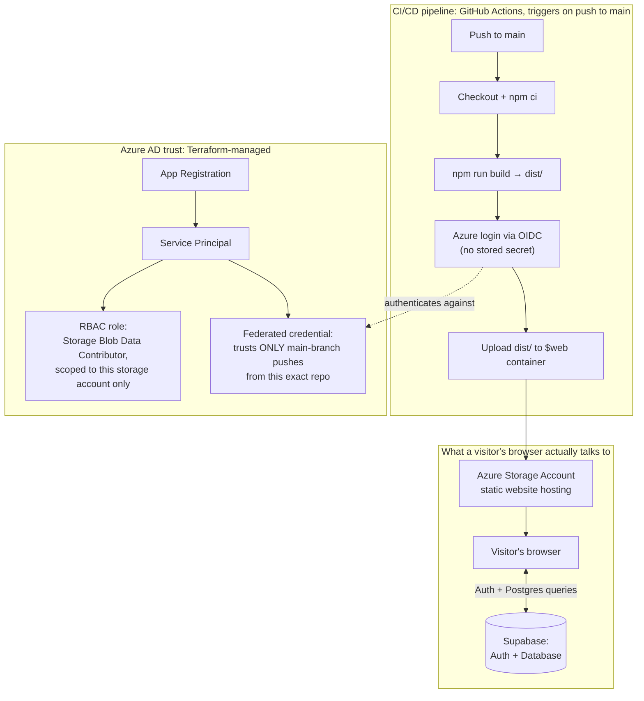

# RPG Map Tracker

An interactive map tracker for open-world RPGs. It tracks quest completion, points of interest and overall progress across Dark Souls 3, Elden Ring and The Witcher 3, instead of relying on a spreadsheet or a checklist.

This started as my final-year Computer Science dissertation at the University of Salford. I redeployed it here to Microsoft Azure as a portfolio piece to show Infrastructure as Code (Terraform), static site hosting, OIDC-authenticated CI/CD and least-privilege RBAC. See [Architecture](#architecture) below for the full breakdown, including why I decided not to add a CDN.

## Features

- Interactive Leaflet map per game, with clickable nodes for quests, items and points of interest
- Supabase-backed authentication and per-user progress persistence
- Quest dependency logic, so prerequisite quests must be completed before dependents unlock, with related items auto-ticking
- Completion-time estimation and a recommendation for what to do next
- Sidebar filtering by category, and a dashboard summarising overall progress

## Tech stack

React 19, TypeScript, Vite, Tailwind CSS, Leaflet / react-leaflet, react-router-dom, Supabase (Postgres + Auth)

## Live demo

**[https://stdissbq4wwi.z33.web.core.windows.net/](https://stdissbq4wwi.z33.web.core.windows.net/)**

## Architecture

All the Azure infrastructure is provisioned with Terraform, no manual portal configuration. Two things happen here: a CI/CD pipeline deploys the app on every push, and a separate Azure AD trust relationship controls who's actually allowed to trigger that deployment.

**Why there's no CDN.** I looked at adding one for edge caching and faster global load times, and decided against it. Azure's classic CDN product doesn't support creating new profiles anymore, and the replacement (Azure Front Door) has a mandatory monthly base fee that doesn't make sense for a low-traffic personal project. I left the Terraform for a CDN written and commented out in `infra/main.tf`, so the implementation is there and understood, it's just not something I chose to pay for. See [Cost notes](#cost-notes) for the full reasoning.

## Deployment

The static build (`npm run build`) is hosted directly on Azure Blob Storage static website hosting, no CDN, see above. GitHub Actions rebuilds and redeploys it automatically on every push to `main`, authenticating to Azure via OIDC federated identity instead of a stored credential.

## Screenshots

**Dashboard**, overall progress summary

**Map view**, interactive quest/POI tracking

**Login**

**Statistics**, per-game completion breakdown by subtype, with time remaining estimates

**Comparison**, side-by-side progress across all 3 games

## Cost notes

**Actual spend: £0.01** (Azure Cost Management, `rg-dissertation-azure` resource group).

This is low because of the architecture decisions above: a single Standard LRS storage account holding a small static build (around 50MB), no CDN base fee (skipped on purpose, see [Architecture](#architecture)), and low personal-testing traffic. Azure Storage's static website hosting is billed on actual usage (storage, transactions, bandwidth) rather than a fixed monthly rate, so a low-traffic portfolio project like this one costs close to nothing to keep running.

## Local development

\`\`\`bash
npm install
npm run dev
\`\`\`

Needs a \`.env\` file with \`VITE_SUPABASE_URL\` and \`VITE_SUPABASE_ANON_KEY\` (not committed, see \`.gitignore\`).
