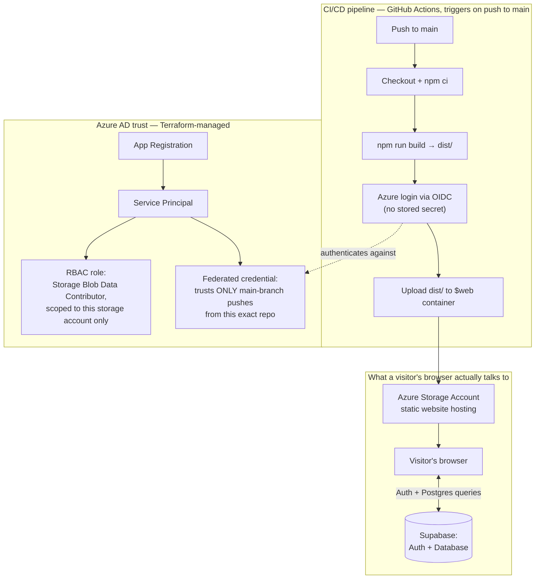
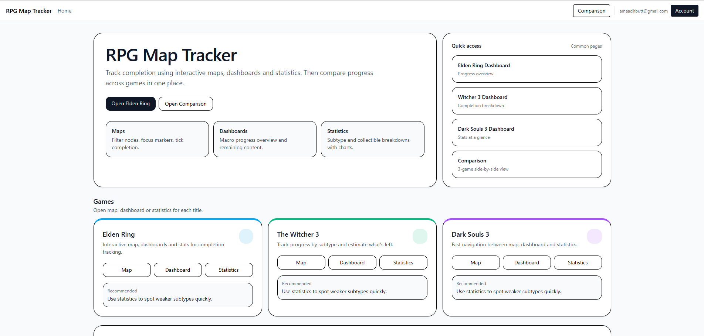
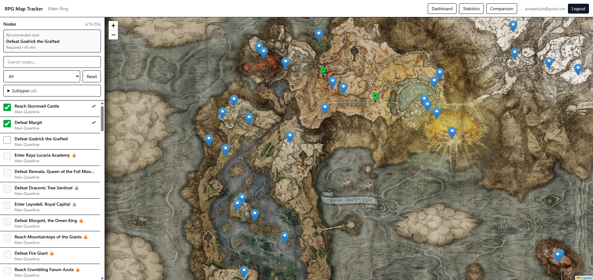
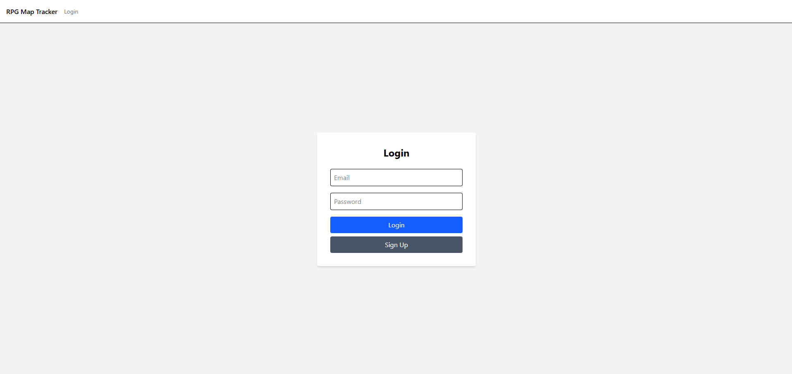
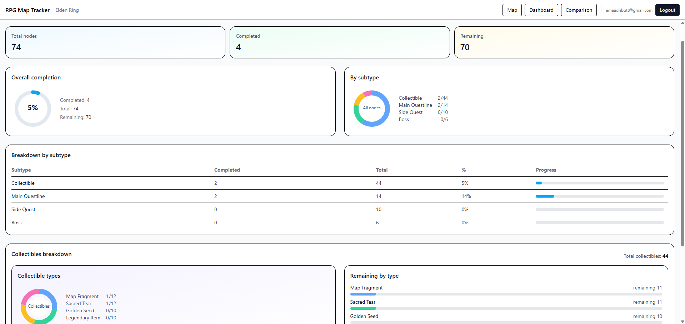
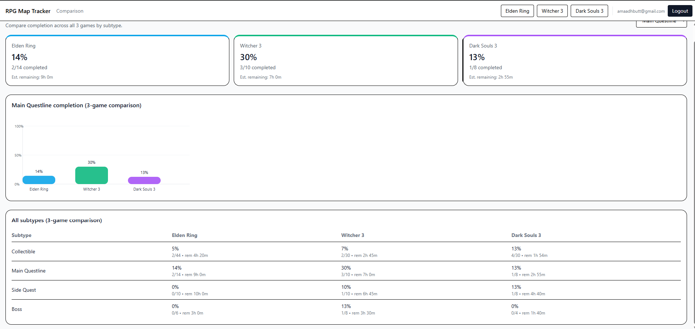

# RPG Map Tracker

An interactive-map progress tracker for open-world RPGs — track quest completion, points of interest, and overall progress across game worlds (Dark Souls 3, Elden Ring, The Witcher 3) instead of relying on a spreadsheet or checklist.

Originally built as a final-year Computer Science dissertation project (University of Salford), redeployed here to Microsoft Azure as a portfolio piece demonstrating Infrastructure as Code (Terraform), static site hosting, OIDC-authenticated CI/CD, and least-privilege RBAC — see [Architecture](#architecture) for a full breakdown, including a deliberate cost-driven decision to skip a CDN layer.

## Features

- Interactive Leaflet map per game, with clickable nodes for quests, items, and points of interest
- Supabase-backed authentication and per-user progress persistence
- Quest dependency logic — prerequisite quests must be completed before dependents unlock, with auto-ticking of related items
- Completion-time estimation and a recommendation heuristic for suggesting what to do next
- Sidebar filtering by category, and a dashboard summarising overall progress

## Tech stack

React 19, TypeScript, Vite, Tailwind CSS, Leaflet / react-leaflet, react-router-dom, Supabase (Postgres + Auth)

## Live demo

**[https://stdissbq4wwi.z33.web.core.windows.net/](https://stdissbq4wwi.z33.web.core.windows.net/)**

## Architecture

All Azure infrastructure is provisioned with Terraform — no manual portal configuration. Two things happen: a CI/CD pipeline deploys the app on every push, and a separate Azure AD trust relationship controls exactly who's allowed to trigger that deployment.

**A deliberate decision worth calling out:** a CDN layer (edge caching, faster global load times) was evaluated and intentionally skipped. Azure's classic CDN product no longer supports creating new profiles, and its replacement (Azure Front Door) carries a mandatory monthly base fee that doesn't make sense for a low-traffic personal project. The Terraform for a CDN is written and preserved (commented out, in `infra/main.tf`) to demonstrate the implementation is understood — the decision not to run it was a cost trade-off, not a skipped step. See [Cost notes](#cost-notes) for the full reasoning.

## Deployment

Static build (`npm run build`) hosted directly on Azure Blob Storage static website hosting (no CDN — see above). GitHub Actions rebuilds and redeploys automatically on every push to `main`, authenticating to Azure via OIDC federated identity rather than a stored credential.

## Screenshots

**Dashboard** — overall progress summary

**Map view** — interactive quest/POI tracking

**Login**

**Statistics** — per-game completion breakdown by subtype, with time-remaining estimates

**Comparison** — side-by-side progress across all 3 games

## Cost notes

**Actual spend: £0.01** (Azure Cost Management, `rg-dissertation-azure` resource group).

This low cost is a direct result of the architecture decisions above: a single Standard LRS storage account holding a small static build (~50MB), no CDN base fee (deliberately skipped — see [Architecture](#architecture)), and low personal-testing traffic volume. Azure Storage's static website hosting is billed on actual usage (storage + transactions + bandwidth) rather than a fixed monthly rate, so an idle or low-traffic portfolio project costs close to nothing to keep running.

## Local development

\`\`\`bash
npm install
npm run dev
\`\`\`

Requires a \`.env\` file with \`VITE_SUPABASE_URL\` and \`VITE_SUPABASE_ANON_KEY\` (not committed — see \`.gitignore\`).
